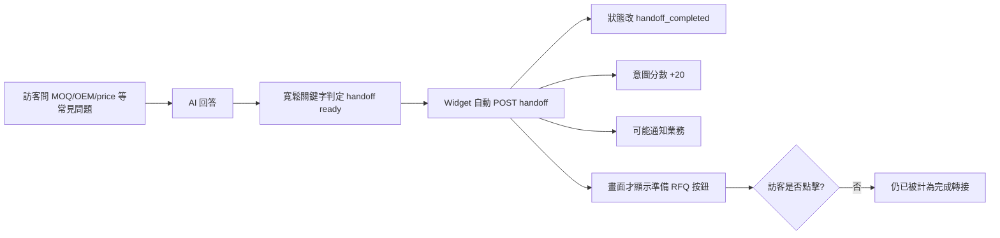

# ForgeBase 前台 AI 客服與相關配置檢視報告

> [!WARNING]
> **歷史稽核。** 本文保留 2026-08-11 當時的 AI Chat 差距與測試證據；目前前台 Product Advisor、後台 AI 業務助理、五語介面與 grounding 邊界，請以 `FORGEBASE_FUNCTION_MODULE_COMPLETENESS_AUDIT_2026-08-15.md`、`FORGEBASE_AI_ADVISOR_IMPLEMENTATION_RECORD_2026-08-18.md` 及 `FORGEBASE_DOCUMENT_AUTHORITY_INDEX_2026-08-28.md` 為準。

日期：2026-08-11\
檢視範圍：前台 Chat Widget、公開 Chat API、回答策略、知識來源、RFQ handoff、租戶隔離、方案與環境配置、管理後台、通知、品質與成本可觀測性\
檢視方式：程式碼審查、桌機／手機實機操作、英文／繁中介面驗證、針對性單元測試與前端型別檢查\

> 本次沒有呼叫真實 LLM 供應商，避免產生外部費用與把測試內容送往第三方；模型回答品質的判斷來自 prompt、context、output contract、fallback 與既有測試的靜態及 deterministic 驗證。

---

## 1. 執行摘要

### 1.1 最終結論

**目前版本屬於「展示版可用，生產環境不可上線」。**

前台外觀清楚、桌機與手機皆有專用版面，也能依頁面建立產品／分類／應用 context；但目前真正影響商業可信度的部分仍有重大缺口：

1. 公開 Chat API 缺乏有效的租戶所有權驗證、方案 gate、Chat 專用 rate limit、每日成本上限與併發鎖。
2. AI 建議 RFQ 後，前端會在訪客尚未點擊「準備 RFQ」前自動完成 handoff、加意圖分數並可能通知業務，造成假轉換與假商機。
3. 回答僅靠 prompt 約束，沒有嚴格輸出 schema、引用驗證、unsupported claim 檢查或 prompt injection 防護。
4. 繁中介面實際混入英文 greeting、建議問題、fallback、追問句與不含 locale 的連結。
5. AI 所稱的 RFQ 預填契約大部分斷裂；需求摘要、訊息、複數 product IDs 等欄位不會真正進入表單。
6. 管理後台能看紀錄與人工評分，但幾乎不能配置 AI 行為，也無法觀察 token、成本、latency、fallback、無法回答率、citation coverage 或真正的 RFQ conversion。

因此，不建議只靠調整 prompt 或換模型就上線。這些問題主要是 API 邊界、狀態機、資料隔離、表單契約與營運配置問題，不是模型能力問題。

### 1.2 評分

| 面向 | 權重 | 評分 | 評語 |
|---|---:|---:|---|
| 前台視覺與基本互動 | 15% | 6.5 / 10 | 桌機完成度佳；手機標題重複、控制尺寸與可及性不足 |
| 回答可靠性與知識 grounding | 25% | 3.0 / 10 | 有誠實回答 prompt，但只有局部 context，沒有 citation／claim validator |
| RFQ 與真人交接正確性 | 15% | 2.0 / 10 | handoff 時機錯誤、轉換失真、prefill 契約斷裂 |
| 安全、隱私與成本護欄 | 20% | 1.5 / 10 | tenant/session 驗證不足，無 Chat rate limit、預算與 session 上限 |
| 租戶配置與營運能力 | 15% | 2.5 / 10 | 主要為全域環境變數，無租戶級 AI 配置中心 |
| 測試與可觀測性 | 10% | 3.0 / 10 | 基本單元測試通過，但關鍵隔離測試是假陽性，無線上品質儀表 |
| **加權總分** | **100%** | **3.0 / 10** | **可展示，不可生產上線** |

---

## 2. 已驗證的正面項目

1. 桌機版 Chat Panel 視覺層級清楚，能在不離開頁面的情況下提供 greeting、建議問題與輸入區。
2. 手機版採 bottom sheet，輸入框與送出按鈕在 390 × 844 viewport 內可操作。
3. 使用者與 AI 訊息以純文字呈現，未把 LLM 輸出當 HTML 注入，XSS 基線較安全。
4. 前後端都有 500 字輸入上限，空白訊息會被阻擋。
5. System prompt 已明確要求：只用 supplied context、不捏造價格／交期／法規、資訊不足時要承認未確認。
6. 產品、分類與應用頁會傳 context entity，設計方向符合 B2B product advisor，而非通用聊天機器人。
7. Admin 可查看逐則對話、來源、訪客意圖、起始頁面，並人工給 1–5 分與備註。
8. 本次驗證結果：`web` TypeScript type-check 通過；Chat deterministic unit tests 為 10 passed、1 deselected。

這些基礎值得保留，但不能抵銷下列生產風險。

---

## 3. P0：上線前必須修正

### P0-1 公開對話 session 缺少完整 tenant ownership 驗證

位置：

- `api/app/api/v1/endpoints/chat.py`
- `api/app/services/chat_service.py`

現況：

- `/sessions/{id}/messages` 只比較 `chat_session.visitor_id == body.visitor_id`，甚至沒有解析 request tenant。
- `/sessions/{id}/handoff` 雖解析 tenant，卻沒有比較 `tenant_id == chat_session.tenant_id`。
- `visitor_id` 由瀏覽器自行產生與提交，不是認證憑證。
- `_ensure_visitor_exists` 與 `_ensure_tracking_session_exists` 遇到已存在 UUID 時，不檢查原 tenant／visitor 所有權。
- `_record_tracking_event` 建立或更新 Visitor、TrackingEvent 時沒有寫入 `tenant_id`。

影響：

- 知道或取得 session UUID 與 visitor UUID 時，存在跨租戶讀寫／handoff 風險。
- Visitor、TrackingSession、TrackingEvent 可能跨租戶污染，導致錯誤意圖分數與錯誤歸因。

硬性修正：所有公開 Chat request 都必須先解析 tenant，並以 `session_id + visitor_id + tenant_id` 同時驗證；所有追蹤寫入都必須帶 tenant；衝突 UUID 必須拒絕而非沿用。

### P0-2 公開 Chat 無方案 gate、有效 rate limit 與成本預算

位置：

- `api/app/api/v1/endpoints/chat.py`
- `api/app/core/rate_limit.py`
- `api/app/services/subscription.py`

現況：

- 方案矩陣已有 `ai_advisor` 與 `chat_handoff`，但公開 Chat API 沒有 `RequireFeature`。
- Admin Chat 頁有 PlanGate，但直接呼叫公開 API 可繞過。
- rate limit 規則只有 login、register、contact、RFQ、tracking，沒有 Chat session、message、handoff。
- 沒有 visitor／tenant／session 三層限制、同 session 併發鎖、每日 tenant 預算、最多訊息數或 idempotency key。
- LLM 呼叫沒有設定 Chat 專用 max output tokens。

影響：匿名流量可大量消耗模型額度；多 worker 時既有記憶體 limiter 也無法共享計數。

硬性修正：公開端點方案 gate、Redis/shared limiter、session 併發鎖、tenant 日預算、每 session 訊息上限、idempotency key、明確 token ceiling，並確保超限時不呼叫模型。

### P0-3 未發布內容可能進入公開 Chat context

位置：`api/app/services/chat_service.py`

現況：

- session 建立時以 `db.get(Product/ProductCategory/Application, id)` 讀取實體，只核對 tenant，未檢查 `status == published`。
- `_build_context` 的產品、分類與應用查詢也未加 published filter。
- 只要 draft entity UUID 被猜到、記錄或連結洩漏，內容就可能被放進公開 prompt。

硬性修正：任何公開 context 必須先套 `tenant_id + status/visibility + locale + validity`，再做查詢與排序；draft／internal 一律視為不存在。

### P0-4 Handoff 在使用者確認前就被標成完成

位置：

- `web/src/components/chat/ChatWidget.tsx`
- `api/app/services/chat_service.py`
- `api/app/api/v1/endpoints/chat.py`

現行流程：



關鍵問題：

- `_detect_handoff` 掃描「使用者問題 + AI 回答」，只要出現 quote、price、MOQ、OEM、custom、lead time、sample 等就觸發。
- 這些詞正是此客服首頁承諾可回答的主題，因此正常諮詢很容易被當成 handoff。
- 前端收到 `handoff_ready` 或 `suggested_action == rfq` 就自動呼叫 handoff API。
- `create_handoff` 立即寫 `handoff_completed`、`chat_rfq_handoff`、意圖加分並啟動通知；訪客點 CTA 不是完成條件。

影響：

- Chat-to-RFQ conversion、handoff completed、hot visitor 全部可能高估。
- 業務收到沒有實際提交意願的假商機。
- 同一 session 可多次觸發 handoff，造成重複通知與分數污染。

硬性修正：AI 只能產生 `handoff_suggested`；只有訪客明確點擊且確認 RFQ draft 後，才建立 conversion／通知／加分。整個流程需要 server-side idempotency。

---

## 4. P1：高優先級可靠性與商業流程問題

### P1-1 Locale 全鏈路斷裂

實機結果：繁中頁的 Widget title、subtitle、placeholder 已翻譯，但 greeting 與三個建議問題仍是英文。

原因：

- 前端有送 `document.documentElement.lang`，schema 也有 `locale`。
- `chat.py` 沒把 `body.locale` 傳入 `ChatService`。
- `ChatSession` 沒保存 locale。
- greeting、suggestions、fallback、clarifying prefix 與規則式 intent terms 全部硬編碼英文。
- sources 與 RFQ URL 沒有 locale prefix。
- FAQ fallback 沒有 locale filter。

影響：多語體驗混亂；中文 MOQ／OEM 意圖、追問與 handoff 不可靠；點來源可能跳回英文頁。

### P1-2 Grounding 和「來源」不等於可驗證引用

現況：

- 首頁／未知頁只取前 5 筆 published FAQ，沒有語意搜尋。
- Product 最多帶 3 FAQ、3 certification；Category／Application 載入關聯後再在 Python slice。
- 沒有 FTS、embedding、hybrid RAG、文件切塊或 page-level citation。
- 回傳的 sources 是「被塞進 context 的資料」，不是模型實際用來支持某句話的證據。
- 前端最多只顯示 2 個 badge，也不指出哪個來源支持哪一個 claim。

影響：看起來像有引用，實際可能只是相關資料清單，容易形成錯誤信任。

### P1-3 回覆安全只靠 prompt，沒有執行層驗證

現況：

- `response_format=json_object` 後直接 `json.loads`，沒有 strict JSON schema／enum／citation ID 驗證。
- 沒有 unsupported claim、pricing／lead-time commitment、legal／safety、expired certification 等 post-validation。
- User question 和 recent history 直接拼進同一 prompt，沒有 delimiter、instruction hierarchy 或 injection detector。
- fallback 一律英文，且沒有 `fallback_used` 對外／對內標記。

影響：模型輸出 JSON 不代表商業內容正確；無法區分「有依據回答」與「模型自行補完」。

### P1-4 RFQ prefill contract 斷裂

後端 handoff URL 可能包含：

- `message`
- `product_ids`（複數，以逗號串接）
- `requirement_summary`
- 其他模型／client 任意送入的 prefill 欄位

但 RFQ 頁／表單實際只完整接受：

- `product_id`（單數，server-side prop）
- `application_id`
- client-side 的 `name`、`email`、`company`

因此 AI 蒐集的需求摘要、原始問題、數量、包裝等多數不會進入 RFQ 表單。再者，prefill 全放 query string，會進瀏覽器歷史、server logs、analytics 與可能的 referrer，不適合承載採購需求或 PII。

正確做法：後端建立具 owner／tenant／expiry 的 RFQ draft ID；前端以 draft ID 取回欄位並讓訪客確認，而不是把內容放 URL。

### P1-5 模型可靠性與失敗處理不足

- Chat 呼叫未指定明確 connect/read/total timeout 與可重試錯誤策略。
- 沒有取消生成、retry、重複送出保護或每 session 單一 in-flight request。
- 同時送出訊息可能競爭 `message_count`、順序與狀態。
- 失敗原因全部落成泛用英文 fallback；前端只顯示泛用錯誤，沒有 retry 或聯絡真人入口。
- OpenAI client 在 module import 時建立，缺少 key 可能讓 API 啟動直接失敗，而非只停用 AI advisor。

### P1-6 Admin 不是「配置中心」，只是檢視與人工備註

目前有：

- 對話列表、狀態／評分篩選。
- 對話全文、來源 badge、訪客意圖、頁面與裝置資訊。
- 管理員 1–5 分與備註。
- handoff 通知偏好開關。

目前沒有：

- 每租戶 Chat 啟停、可用頁面與 rollout percentage。
- greeting、suggestions、fallback、品牌語氣與支援語系。
- allowed／blocked topics、風險類別與真人交接規則。
- AI model、max tokens、timeout、每日預算、session 上限。
- 可用知識來源、visibility、locale、有效日期與 reindex 狀態。
- handoff threshold、office hours、負責人、SLA、聯絡方式。
- 資料保留期限、刪除／匯出與隱私設定。
- latency、token、成本、fallback、answer-not-found、citation coverage、visitor feedback、真正 RFQ conversion。

此外，列表頁的「已轉業務接手、平均訊息數、未評分」是用當頁 25 筆計算，但總對話數是全量，KPI 口徑不一致。

---

## 5. P2：前台體驗與可及性問題

1. **手機版標題重複**：Sheet header 與 ChatPanel header 都顯示「AI 產品顧問」。
2. **手機關閉目標過小**：實測約 16 × 16 px，遠低於一般觸控目標建議；桌機 X-only 按鈕也沒有明確 aria-label。
3. **輸入框只有 placeholder**：沒有 label／aria-label，也沒有說明 Ctrl/Cmd + Enter 才送出。
4. **沒有自動捲到底部**：多輪對話加入新訊息後沒有 scroll anchor 或 `scrollIntoView`。
5. **頁面導航會遺失對話**：Widget state 只在目前 React component；點來源或換頁後新建 session，無 resume 機制。
6. **Chat start 被高估**：一打開 Widget 就建立 session、記 `chat_start` 並加 8 分，即使訪客沒有送出任何問題。
7. **`suggested_action=contact` 沒有 UI**：只處理 RFQ，無聯絡真人 CTA。
8. **沒有訪客品質回饋**：無 thumbs up/down、問題是否解決、回報錯誤來源。
9. **沒有 AI 與隱私揭露**：未提示 AI 可能出錯、對話會被保存／人工檢視、不要輸入機密或個資，也沒有 chat-scoped privacy link。
10. **錯誤恢復不足**：只有 session unavailable／request failed，沒有 retry、重新建立 session、聯絡客服或稍後再試資訊。
11. **來源 UX 不足**：最多顯示 2 個來源、沒有片段或欄位證據，使用普通 `<a>` 會造成整頁導航與對話遺失。

---

## 6. 現有配置盤點

| 配置 | 現況 | 評價 |
|---|---|---|
| Chat 啟停 | `NEXT_PUBLIC_CHAT_DISABLED`，build-time 全站開關 | 可緊急關閉，但不是租戶級、runtime 或漸進 rollout |
| API URL／Tenant | `NEXT_PUBLIC_API_URL`、tenant header | 基本可用；tenant ownership 邊界不完整 |
| 模型 | `AI_MODEL_NAME`，API 全域環境變數 | 無租戶、workflow、版本或 A/B 配置 |
| Provider key | `OPENAI_API_KEY`，API 全域環境變數 | 無每租戶預算／usage allocation；缺 key 會影響 import/startup |
| 方案能力 | `ai_advisor`、`chat_handoff` 已存在於 plan matrix | 公開 Chat API 未 enforce，形同只鎖後台 |
| Handoff 通知 | 管理後台有通知偏好 | 觸發時機錯誤；裸 `asyncio.create_task`，無可靠 outbox／retry |
| Prompt／語氣 | 寫死在 `chat_service.py` | 無版本、審批、租戶客製與 regression 關聯 |
| Greeting／Suggestions | service 內英文常數 | 不支援租戶／locale 配置 |
| 風險／Handoff threshold | 英文關鍵字與 policy 常數 | 過度寬鬆、不可營運調整、無多語可靠性 |
| 知識來源 | 當前頁周邊 CMS 關聯 | 無知識管理、visibility、有效日期、RAG、citation contract |
| 成本／上限 | 無 Chat 專用配置 | 生產不可接受 |
| Retention／Privacy | 未見 Chat 專用策略與清除工作 | 必須補法規與營運政策 |

### 建議的租戶級配置物件

至少需要以下欄位，並有版本、審批與 audit log：

```text
enabled
rollout_percentage
supported_locales
greeting_by_locale
suggestions_by_locale
brand_tone
allowed_topics
blocked_topics
risk_handoff_rules
human_contact / office_hours / sla
model / max_output_tokens / timeout_seconds
max_messages_per_session
daily_message_limit / daily_cost_budget
knowledge_visibility / source_collections
retention_days
visitor_feedback_enabled
chat_rag_enabled
chat_human_handoff_enabled
```

---

## 7. 測試與可觀測性評價

### 7.1 本次執行

- `web`: `npm run type-check` → 通過。
- `api`: `pytest tests/test_chat.py -k "not auto_bootstraps" -q` → 10 passed、1 deselected。
- Browser：桌機英文、手機英文、手機繁中 session 建立與 UI 驗證通過。
- 未呼叫真實 LLM，未驗證 provider latency／token／費用與線上模型回答。

### 7.2 測試缺口

- 現有 `test_multitenant.py` 使用錯誤路由 `/api/v1/chat-admin/...`，實際路由為 `/api/v1/chat/admin/...`；測試接受 403/404，因此錯誤路由本身的 404 會讓隔離測試假通過。
- 沒有公開 message／handoff 的跨租戶 endpoint test。
- 沒有 rate limit、成本上限、併發、idempotency、timeout、invalid JSON、fallback 標記測試。
- 沒有 draft/internal knowledge leakage、prompt injection、citation validity 測試。
- 沒有 Chat → RFQ draft → 使用者確認 → 正式 RFQ 的 E2E。
- 沒有多語 golden dataset 與 production regression gate。
- 沒有 visitor-facing CSAT／resolved rate，因此 Admin 的人工分數不能代表使用者感受。

### 7.3 可觀測性缺口

Chat 雖使用可被 Langfuse wrapper 包裝的 OpenAI client，但沒有把 `observe_workflow` 與 `attach_trace_metadata` 接到 Chat 主流程，因此無法可靠依 tenant、session、route、fallback 與 workflow 分組。Admin 也看不到 latency、token、cost、provider error、fallback、retrieval hit、citation coverage 或 handoff reason。

---

## 8. 建議處置與優先順序

### 8.1 立即決策

在 P0 完成前，生產環境建議設 `NEXT_PUBLIC_CHAT_DISABLED=true`。若需保留展示，只限內部／demo tenant，並阻擋公開模型額度與通知。

### 8.2 止血階段：1–3 個工作天

1. 公開 Chat endpoint 強制 tenant/session/visitor 三者一致。
2. 公開端點 enforce `ai_advisor`／`chat_handoff` feature gate。
3. 加 shared rate limit、tenant 日預算、session 上限、單一 in-flight 與 idempotency。
4. Product／Category／Application 全部加 published、locale、visibility filter。
5. 移除前端自動 handoff；只有使用者點擊確認才建立 conversion 與通知。
6. Server-side handoff idempotency，通知改 durable outbox／可重試工作。
7. 修正 RFQ prefill 契約；短期至少只傳合法欄位，正式改 RFQ draft ID。

### 8.3 可靠性階段：1–2 週

1. Locale 從 Web → API → session → retrieval → prompt → policy → URL 全鏈路打通。
2. Strict response schema、answer status、risk category、citation IDs、qualification slots。
3. Unsupported claim／citation／expired certification validator。
4. Prompt delimiter、injection detector、公開／登入／internal 知識權限。
5. 明確 timeout、一次 retry、取消、fallback_used 與錯誤分類。
6. Chat retention、刪除／匯出、AI disclosure 與隱私提示。
7. 修正手機重複 header、關閉按鈕尺寸、input label、auto-scroll、contact CTA 與 retry UX。

### 8.4 可信知識與營運階段：2–4 週

1. 建立 public approved knowledge index，CMS + 核准 PDF、hybrid retrieval、版本與有效日期。
2. 建立 Admin AI 配置中心與 canary rollout。
3. 建立多語 golden dataset、prompt/model/index regression gate。
4. 儀表至少包含：p50/p95 latency、token、成本、fallback、not-found、citation coverage、visitor helpfulness、handoff suggestion、handoff click、RFQ draft confirm、正式 RFQ。
5. 只在達到驗收門檻後逐租戶開啟。

---

## 9. 恢復上線的硬性驗收條件

- [ ] 租戶 A 無法以任何 visitor/session 組合操作租戶 B 的 Chat。
- [ ] Starter 或未啟用租戶呼叫公開 Chat 得到明確 403。
- [ ] 多 worker 下 rate limit、預算與 in-flight lock 一致。
- [ ] draft、unpublished、expired、internal 內容不會進 prompt、reply、source 或 trace。
- [ ] Chat 開啟不等於有效對話；RFQ 建議不等於 handoff completed。
- [ ] 只有訪客確認 RFQ draft 才計 conversion、加分與通知。
- [ ] RFQ draft 可完整保留數量、產品、包裝、市場、時程與原始需求，且不放 query string。
- [ ] en／zh-TW 至少 greeting、suggestion、reply、fallback、clarification、source URL、RFQ URL 全程同語言。
- [ ] 價格、交期、法規、認證適用性、安全與客訴問題通過風險交接測試。
- [ ] 每個公司事實 citation 都能指向實際 supporting source，而非只有相關 badge。
- [ ] timeout、invalid JSON、provider error、policy rejection 都有可辨識且可觀察的 fallback。
- [ ] Admin 可看 token、成本、latency、fallback、not-found、citation coverage 與真正 RFQ funnel。
- [ ] 通過多語 golden dataset、跨租戶 integration、Chat-to-RFQ E2E、手機與可及性測試。

---

## 10. 與既有開發計畫的對照

專案內已有 `FORGEBASE_AI_CUSTOMER_SERVICE_DEVELOPMENT_PLAN.md`，其 Phase 0 正確涵蓋 rate limit、locale、風險交接、timeout/tracing、published visibility 與 prompt isolation。本次 2026-08-11 實際讀碼與操作結果顯示：**該 Phase 0 的完成定義目前仍未達成，且舊報告列出的 D1–D10 大部分仍存在。**

建議不要另起一套方向；直接把本報告的 P0 與硬性驗收條件轉成既有 AI-001～AI-005 的 release gate，再執行後續 RAG、RFQ draft 與營運儀表工作。
